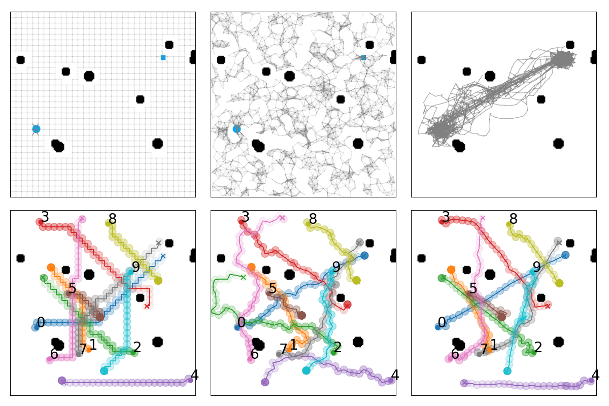
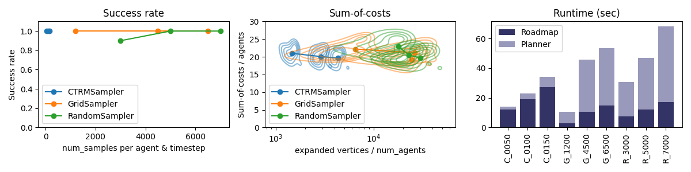

# JAXMAPP: JAX-based Library for Multi-Agent Path Planning in Continuous Spaces
 



JAXMAPP is a JAX-based library for multi-agent path planning (MAPP) in continuous spaces, with a particular emphasis on roadmap construction and evaluation. With JAXMAPP, You can:
- Create MAPP problem instances with homogeneous/heterogeneous agents
- Construct roadmaps and perform prioritized planning to solve MAPP
- Develop and evaluate your own roadmap construction methods 

Main contributors: Ryo Yonetani ([@yonetaniryo](https://github.com/yonetaniryo)), Keisuke Okumura ([@Kei18](https://github.com/Kei18)), Mai Nishimura ([@denkiwakame](https://github.com/denkiwakame))

## Installation

The code has been tested on Ubuntu 16.04 and 18.04, as well as WSL2 (Ubuntu 20.04) on Windows 11. Planning can be performed only on the CPU, and the use of GPUs is also supported for training/evaluating machine-learning models. We also provide Dockerfile to replicate our setup. 

### venv 

```console
$ python -m venv .venv
$ source .venv/bin/activate
(.venv) $ pip install -e .[dev]
```

### Docker container
```console
$ docker-compose build
$ docker-compose up -d dev
$ docker-compose exec dev bash
```

### Docker container with CUDA enabled 
```console
$ docker-compose up -d dev-gpu
$ docker-compose exec dev-gpu bash
```

and update JAX modules in the container...

```console
# pip install "jax[cuda]" -f https://storage.googleapis.com/jax-releases/jax_releases.html
```

## Tutorials
- [1. Quickstart: Create MAPP problems and solve them using default roadmap construction methods](https://github.com/omron-sinicx/jaxmapp/blob/main/tutorials/1.%20Quickstart.ipynb)
- [2. Develop roadmap construction methods](https://github.com/omron-sinicx/jaxmapp/blob/main/tutorials/2.%20Develop%20roadmap%20construction%20methods.ipynb)
- [3. Benchmarking roadmap construction methods](https://github.com/omron-sinicx/jaxmapp/blob/main/tutorials/3.%20Benchmarking%20roadmap%20construction%20methods.ipynb)
- [4. Training sampler](https://github.com/omron-sinicx/jaxmapp/blob/main/tutorials/4.%20Training%20sampler.ipynb)


## Citation

```
@misc{jaxmapp_2022,
author = {Yonetani, Ryo and Okumura, Keisuke},
month = {2},
title = {JAXMAPP: JAX-based Library for Multi-Agent Path Planning in Continuous Spaces},
url = {https://github.com/omron-sinicx/jaxmapp},
year = {2022}
}


@inproceedings{okumura2022ctrm,
title={CTRMs: Learning to Construct Cooperative Timed Roadmaps for Multi-agent Path Planning in Continuous Spaces},
author={Okumura, Keisuke and Yonetani, Ryo and Nishimura, Mai and Kanezaki, Asako},
booktitle={Proceedings of the International Conference on Autonomous Agents and Multiagent Systems (AAMAS)},
year={2022}
}
```
